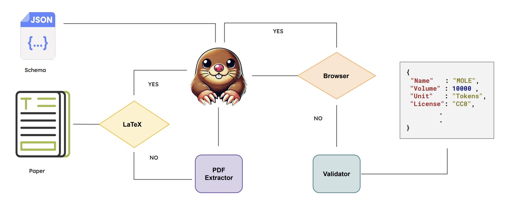

# MOLE

A framework and dataset for extracting and validation metadata extraction from scientific papers. 



## Features
- Extract arXiv papers by keywords, month, and year
- Clean and process LaTeX/PDF papers
- Extract detailed metadata using AI models (Claude, ChatGPT, Gemini)
- Validate extracted metadata against a reference dataset

## Installation
```bash
git clone https://github.com/zaidalyafeai/MOLE
cd MOLE
pip install -r requirements.txt
```

## Evaluation
Given a schema we can run evaluation using the following code. We use OpenRouter to run inference. You have to create `.env` file in the directory and save the API key OPENROUTER_API_KEY=sk-***. 
```bash
python evaluate.py --models google/gemini-flash-1.5 -mv --schema ar -o --few_shot 0 --results_path results_latex
```

Parameters

- `--models` the name of the models from OpenRouter.
- `-mv` validation or use `-mt` for testing
- `--schema` the name of the schema. You can choose from `ar,en,jp,fr,ru,multi`
- `-o` overwrite the current results. if not set, the it will load the saved metadata
- `--few_shot` fewshot size, 0 for zeroshot.
- `--results_path` the save path in the static directory. 
- `--pdf_mode` use this parameter to use the pdf mode. You can set either `plumber` or `docling`.

## Plots 

```
python plots.py --schema all --eval test --results_path static/results_latex --group_by language --non_browsing
```

| Model             |   ar  |   en  |   jp  |   fr  |   ru  | multi | Average | Weighted Average |
|-------------------|-------|-------|-------|-------|-------|--------|---------|-------------------|
| Gemma 3 27B       | 56.69 | 60.00 | 66.32 | 70.00 | 66.67 | 53.68  |  62.23  | 60.30             |
| Llama 4 Maverick  | 58.28 | 66.67 | 68.42 | 68.89 | 68.89 | 58.95  |  65.01  | 62.67             |
| Qwen 2.5 72B      | 64.17 | 62.22 | 64.21 | 71.11 | 65.56 | 55.79  |  63.84  | 63.96             |
| DeepSeek V3       | 64.17 | 70.00 | 65.26 | 64.44 | 70.00 | 54.74  |  64.77  | 64.56             |
| Claude 3.5 Sonnet | 60.54 | 66.67 | 71.58 | 74.44 | 73.33 | 61.05  |  67.94  | 65.37             |
| GPT 4o            | 64.17 | 71.11 | 69.47 | 70.00 | 73.33 | 60.00  |  68.02  | 66.68             |
| Gemini 2.5 Pro    | 65.31 | 72.22 | 74.74 | 68.89 | 73.33 | 56.84  |  68.55  | 67.42             |

parameters

- `--schema` choose the schema, `all` for all schema
- `--eval` what split to use, either `valid` or `test`
- `--results_path` the path to fetch the results from
- `--group_by` how to show the results, choose from the following `evaluation_subsets, attributes, attributes_few, language`
- `--browsing` show the results for browsing only or `--non_borwsing` will show for non browsing models.

## Server

You can run the server using the following code

```
uvicorn main:app
```

Run inference using the running server

```
curl -X POST "http://localhost:8000/run" \
  -F "link=https://arxiv.org/abs/2004.14303" \
  -F "schema=ar" 
```

Example extracted metadata using Gemini 2.5 Pro

```python
{
    "metadata": {
        "Name": "TUNIZI",
        "Subsets": [],
        "Link": "https://github.com/chaymafourati/TUNIZI-Sentiment-Analysis-Tunisian-Arabizi-Dataset",
        "HF Link": "",
        "License": "unknown",
        "Year": 2020,
        "Language": "ar",
        "Dialect": "Tunisia",
        "Domain": [
            "social media"
        ],
        "Form": "text",
        "Collection Style": [
            "crawling",
            "manual curation",
            "human annotation"
        ],
        "Description": "TUNIZI is a sentiment analysis dataset of over 9,000 Tunisian Arabizi sentences collected from YouTube comments, preprocessed, and manually annotated by native Tunisian speakers.",
        "Volume": 9210.0,
        "Unit": "sentences",
        "Ethical Risks": "Medium",
        "Provider": [
            "iCompass"
        ],
        "Derived From": [],
        "Paper Title": "TUNIZI: A TUNISIAN ARABIZI SENTIMENT ANALYSIS DATASET",
        "Paper Link": "https://arxiv.org/abs/2004.14303",
        "Script": "Latin",
        "Tokenized": false,
        "Host": "GitHub",
        "Access": "Free",
        "Cost": "",
        "Test Split": false,
        "Tasks": [
            "sentiment analysis"
        ],
        "Venue Title": "International Conference on Learning Representations",
        "Venue Type": "conference",
        "Venue Name": "International Conference on Learning Representations 2020",
        "Authors": [
            "Chayma Fourati",
            "Abir Messaoudi",
            "Hatem Haddad"
        ],
        "Affiliations": [
            "iCompass"
        ],
        "Abstract": "On social media, Arabic people tend to express themselves in their own local dialects. More particularly, Tunisians use the informal way called 'Tunisian Arabizi'. Analytical studies seek to explore and recognize online opinions aiming to exploit them for planning and prediction purposes such as measuring the customer satisfaction and establishing sales and marketing strategies. However, analytical studies based on Deep Learning are data hungry. On the other hand, African languages and dialects are considered low resource languages. For instance, to the best of our knowledge, no annotated Tunisian Arabizi dataset exists. In this paper, we introduce TUNIZI as a sentiment analysis Tunisian Arabizi Dataset, collected from social networks, preprocessed for analytical studies and annotated manually by Tunisian native speakers."
    },
}
```

## Citation

```
@misc{
}
```